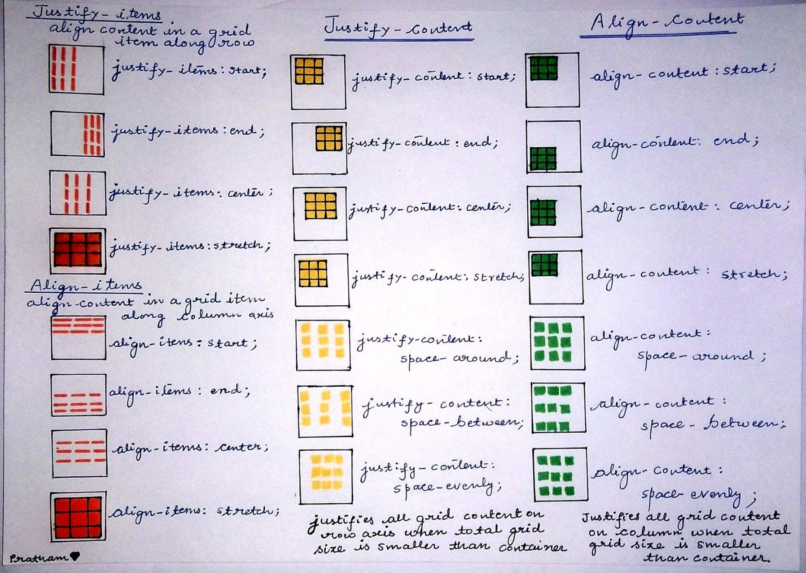
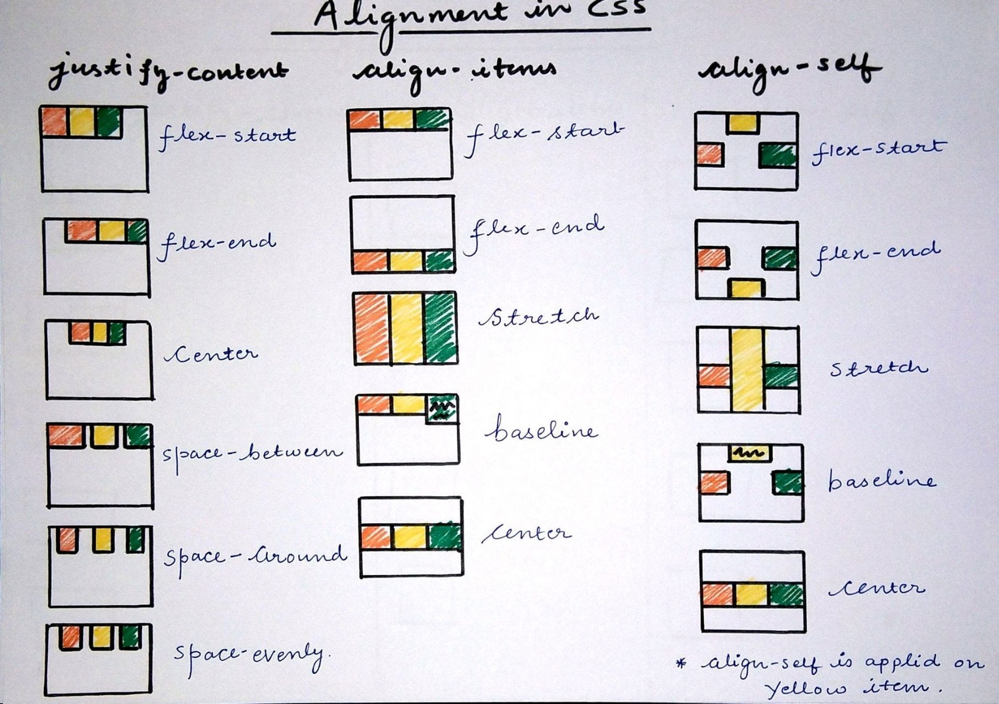
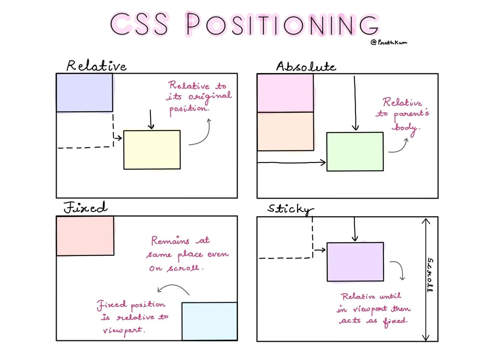
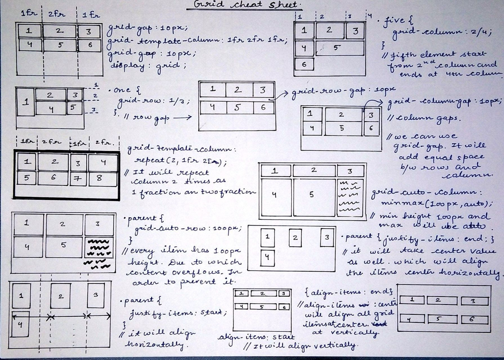
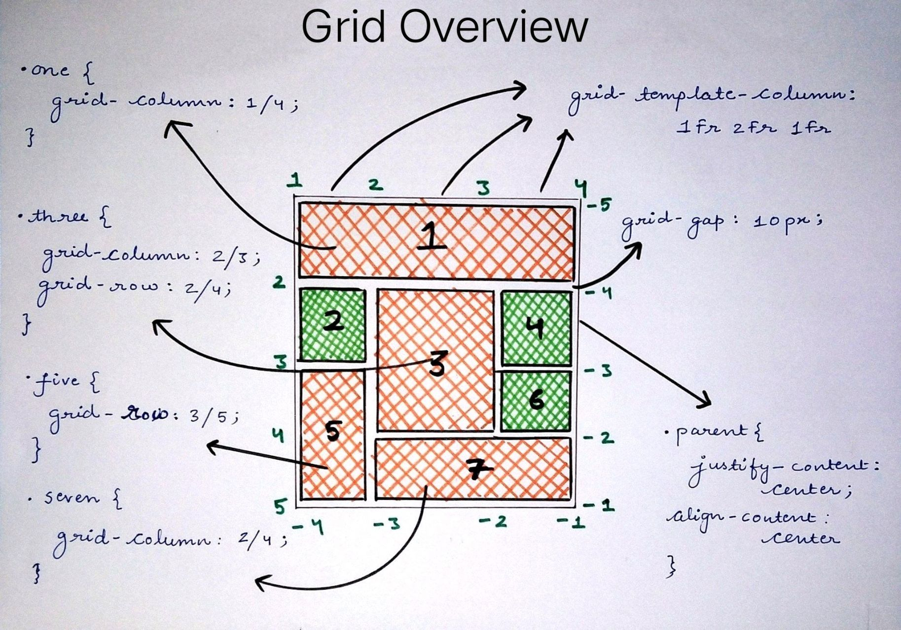

# CSS Positioning and Alignment

## Position and Alignment

Position is another CSS property that deals with alignment and organization of HTML elements. Generally partnered with the position property are the alignment properties: top, right, bottom, left. In a specific combination of position and alignment properties, you obtain the same styling that is used for the bottom footer of this page. Notice how it always seems to stick to the bottom even when you scroll down. That is because it is rendered to the window and not technically to the page.

## CSS Position and Alignment Properties Values

- absolute – stays where you tell it regardless of other objects
- fixed – appended to window (moves when user scrolls)
- relative – placed next its normal position
- static – placed in its default position
   
   

---

## Cheat Sheet

 

---

## CREDITS: [Pratham](https://www.linkedin.com/in/pratham-abb051175/)
